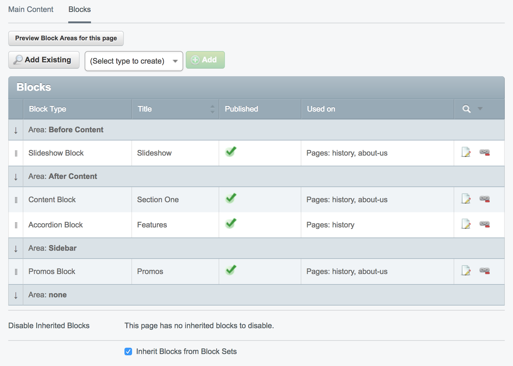

# dynamic-blocks
[](https://travis-ci.org/dynamic/dynamic-blocks)
[](https://scrutinizer-ci.com/g/dynamic/dynamic-blocks/?branch=master)
[](https://scrutinizer-ci.com/g/dynamic/dynamic-blocks/?branch=master)
[](https://codecov.io/gh/dynamic/dynamic-blocks)

A collection of blocks for the SilverStripe Blocks module:

* Accordion
* Call To Action
* Child Pages
* Customer Service (map and contact info)
* Email Newsletter Signup
* Embedded Content
* Form (requires silverstripe/userforms)
* Image
* Page Sections
* Photo Gallery
* Promos
* Recent Blog Posts (requires silverstripe/blog)
* Slideshow

## Requirements

- SilverStripe ^4.0

## Installation

`composer require dynamic/dynamic-blocks`

## Example usage

Dynamic Blocks uses `micschk/silverstripe-groupable-gridfield` to enhance the CMS interface.



All blocks are available in the CMS by default. To exclude certain blocks in a project, do the following in your `config.yml`:

```
BlockManager:
  disabled_blocks:
    - AccordionBlock
    - ChildPagesBlock
```

